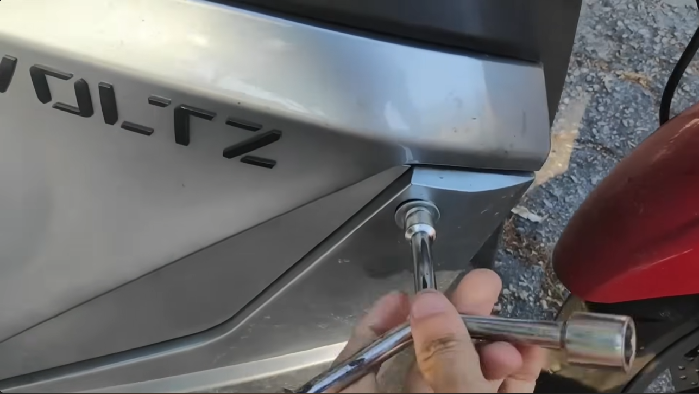
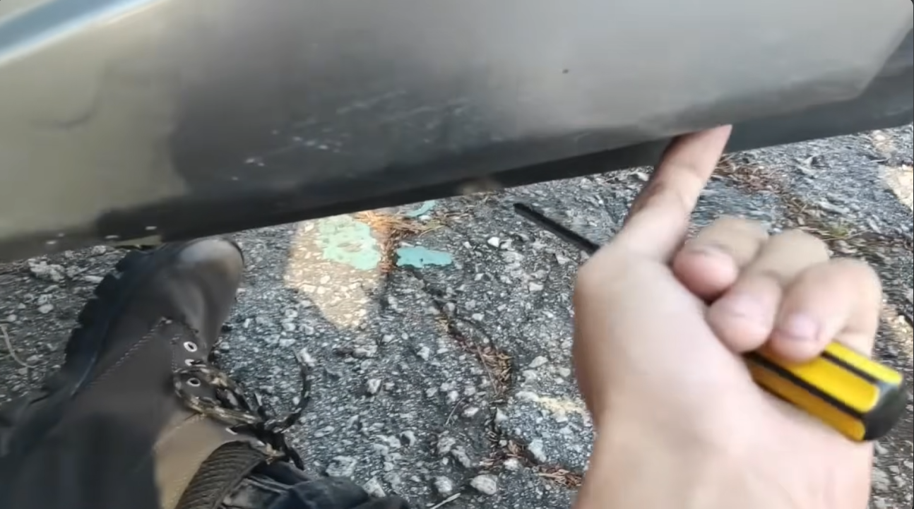
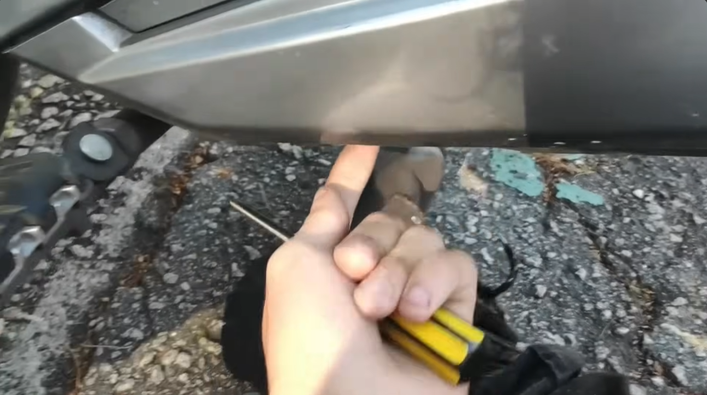
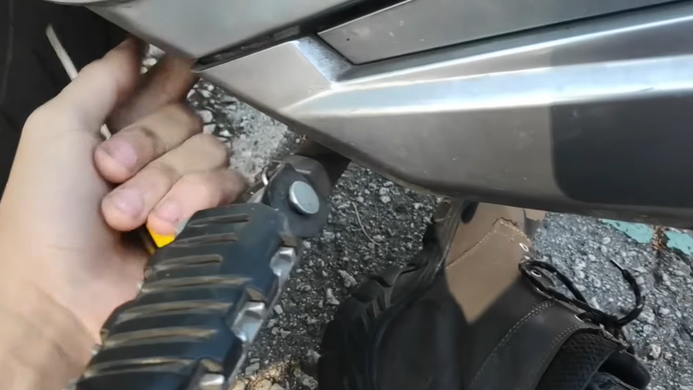
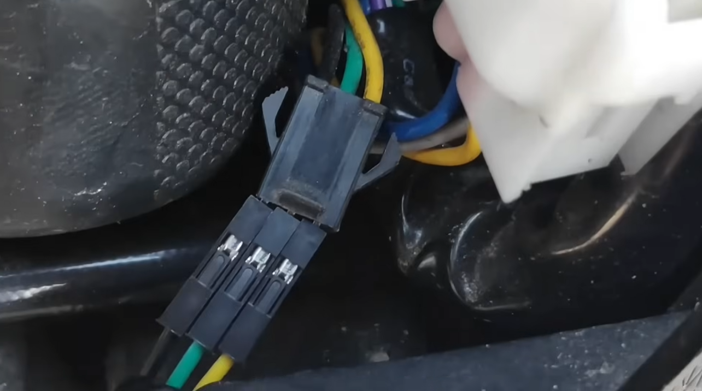
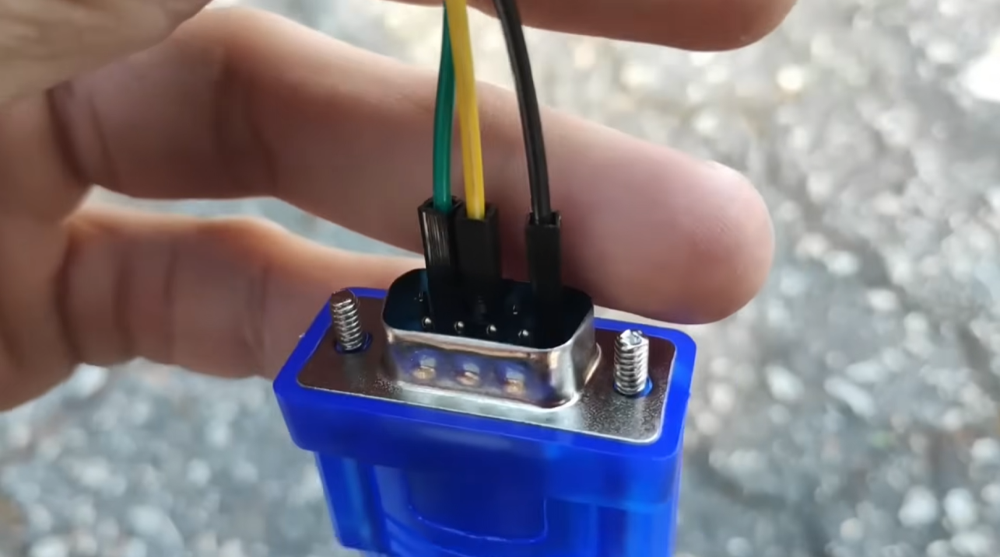
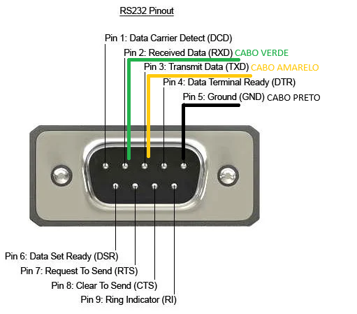
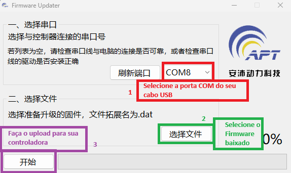

# LEIA COM ATENÇÃO!

**Se você nunca fez um remap da controladora é importante compreender algumas etapas, recomendo seguir o vídeo abaixo onde o Joch descreve com precisão esse procedimento.**

## 🌟 Objetivo / O que você vai aprender

Como Reprogramar a controladora original da VOLTZ

## 🧰 Pré-requisitos

- Computador com sistema operacional Windows.
- Conhecimento básico em informática e uso do computador.
- Aplicativos disponibilizados neste repositório.
- <a href="https://shopee.com.br/Cabo-Db9-Adaptador-Usb-2.0-Serial-Rs232-Conversor-9-Pinos-i.404162541.10814284463" target="_blank" rel="noopener noreferrer">Shopee.com.br - Cabo RS232</a> 
- ou compre pessoalmente o cabo RS232 na santa efigenia ( rua vitoria, 24 ) - newportcom
- jump de fios para ligar no RS232 e conector da moto.

## ⏱️ Vídeo de demonstração

  

## ⏱️ Momentos importantes do vídeo

<ul>
  <li>
    <strong>
    <a href="https://www.youtube.com/watch?v=k8r8NSqz_7c&t=0s" target="_blank" rel="noopener noreferrer">
      00:00 – Intro</strong>
    </a> 
  </li>

  <li>
    <strong>
    <a href="https://www.youtube.com/watch?v=k8r8NSqz_7c&t=19s" target="_blank" rel="noopener noreferrer">
      00:19 – Ferramentas</strong>
    </a> 
  </li>

  <li>
    <strong>
    <a href="https://www.youtube.com/watch?v=k8r8NSqz_7c&t=45s" target="_blank" rel="noopener noreferrer">
      00:45 – Abrindo a moto</strong>
    </a> 
  </li>

  <li>
    <strong>
    <a href="https://www.youtube.com/watch?v=k8r8NSqz_7c&t=125s" target="_blank" rel="noopener noreferrer">
      02:05 – Instalação</strong>
    </a> 
  </li>

  <li>
    <strong>
    <a href="https://www.youtube.com/watch?v=k8r8NSqz_7c&t=215s" target="_blank" rel="noopener noreferrer">
      03:35 – Bateria / Voltagem</strong>
    </a> 
  </li>

  <li>
    <strong>
    <a href="https://www.youtube.com/watch?v=k8r8NSqz_7c&t=270s" target="_blank" rel="noopener noreferrer">
      04:30 – Ângulo do sensor Hall</strong>
    </a> 
  </li>

  <li>
    <strong>
    <a href="https://www.youtube.com/watch?v=k8r8NSqz_7c&t=310s" target="_blank" rel="noopener noreferrer">
      05:10 – Curva de aceleração</strong>
    </a> 
  </li>

  <li>
    <strong>
    <a href="https://www.youtube.com/watch?v=k8r8NSqz_7c&t=330s" target="_blank" rel="noopener noreferrer">
      05:30 – Modos de condução</strong>
    </a> 
  </li>

  <li>
    <strong>
    <a href="https://www.youtube.com/watch?v=k8r8NSqz_7c&t=377s" target="_blank" rel="noopener noreferrer">
      06:17 – RPM</strong>
    </a> 
  </li>

  <li>
    <strong>
    <a href="https://www.youtube.com/watch?v=k8r8NSqz_7c&t=565s" target="_blank" rel="noopener noreferrer">
      09:25 – Regenerativo em ação</strong>
    </a> 
  </li>

  <li>
    <strong>
    <a href="https://www.youtube.com/watch?v=k8r8NSqz_7c&t=613s" target="_blank" rel="noopener noreferrer">
      10:13 – Outras funções</strong>
    </a> 
  </li>

  <li>
    <strong>
    <a href="https://www.youtube.com/watch?v=k8r8NSqz_7c&t=659s" target="_blank" rel="noopener noreferrer">
      10:59 – Relatório de erros</strong>
    </a> 
  </li>

  <li>
    <strong>
    <a href="https://www.youtube.com/watch?v=k8r8NSqz_7c&t=676s" target="_blank" rel="noopener noreferrer">
      11:16 – Despedidas</strong>
    </a> 
  </li>
</ul>

# 🛠️ Acesso ao Conector e Preparação da Moto

## 🔧 Remoção da Tampa Lateral Direita

Para acessar o conector de programação da moto, será necessário remover a tampa lateral direita.

Siga os passos:

1. Remova **1 parafuso soquete 10 mm**  
   

2. Remova os **3 parafusos Philips** inferiores:

   **Parafuso 1**  
   

   **Parafuso 2**  
   

   **Parafuso 3**  
   

---

## 🔌 Localizando o Cabo de Programação

Com a tampa removida, procure pelo **cabo de programação**, que costuma ficar solto e sem nada conectado.

- Geralmente possui **3 fios**
- Normalmente é **preto**

---

# 🔄 Conectando o Cabo RS232

Conecte os fios do cabo RS232 ao conector da moto exatamente como nas imagens:

> **Nota:** As cores dos jumpers não têm importância; foram escolhidas apenas para referência visual.

Após conectar os fios, plugue o cabo **USB no computador**.

⚠️ **IMPORTANTE:** a moto **deve estar ligada** para que a conexão seja detectada pelo computador.

---

# 🖥️ Instalação dos Drivers e Ferramentas

Caso seja a primeira vez usando o cabo RS232, você precisará instalar os drivers.

## 📥 Download dos Arquivos Necessários

Baixe o pacote completo:

https://www.mediafire.com/file/qp3jqa59ml69mdg/REMAP.rar/file

Após baixar:

1. Descompacte o arquivo.
2. Entre na pasta **REMAP**.
3. Abra **REPROGRAMAR EVS WORK**  
   *(Embora o nome seja “EVS WORK”, os drivers servem para EVS e EVS WORK)*.
4. Abra a pasta **INSTALAÇÃO**.

## ▶️ Instale os arquivos na seguinte ordem:

1. `A Parte1`
2. `A Parte2`
3. `A Parte3`
4. `A Parte4`

> **Execute todos como administrador:** clique com o botão direito → *Executar como administrador*

Após a instalação, você terá:

- Drivers do cabo instalados  
- Programa de REMAP funcionando  

---

# 🔄 Baixando o Firmware da Moto

Agora será necessário baixar o firmware correto para o seu modelo de moto.

## 📥 Firmware EVS

https://github.com/togwar/voltz-evs/tree/main/Firmware/APT/evs

## 📥 Firmware EVS WORK

https://github.com/togwar/voltz-evs/tree/main/Firmware/APT/evs-work

Leia com atenção para escolher:

- Firmware para **1 bateria**, ou  
- Firmware para **2 baterias**

Baixe também o **software** correspondente ao modelo da sua moto.

---

# ⚙️ Atualizando o Firmware

Abra o programa **Firmware Updater**, que se parece com isto:

Siga as instruções mostradas na tela.

Se você não souber qual porta **COM** usar, siga o trecho do vídeo:

  

