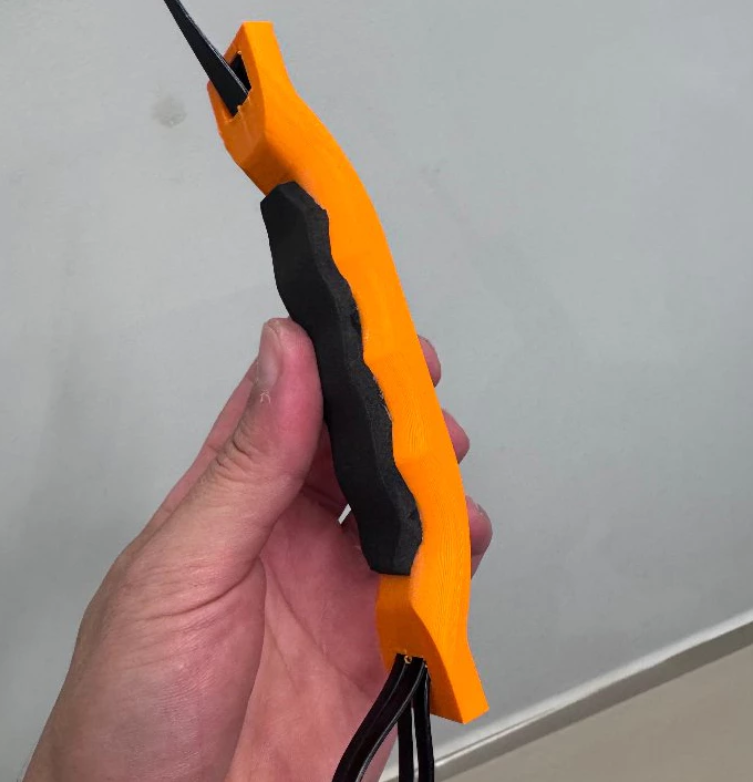

# Alça da Bateria Voltz EVS

Compre sua alça pronta através do link:
https://shopee.com.br/product/607821839/22091668149/
**Direto com o inventor

- ALÇA da BATERIA quebrou? Aqui está a Solução

  

## 🌟 Objetivo / O que você vai aprender

Tutorial para instalação da Alça de Bateria da moto Voltz EVS.  
A alça foi projetada e desenvolvida pelo Euller (instagram @hook3.d) e é feita com impressão 3D em ABS, sendo a  estrutura de Nylon e acabamento em EVA.  

## ⏱️ Imagens ou Prints importantes do vídeo/tutorial

  

## 💾 Arquivos para Download:  
- Download do arquivo 3D: <strong><a href="https://github.com/togwar/voltz-evs/raw/main/Solucoes/Euller3D/Alca-de-Bateria-Voltz-EVS/5936588.zip" target="_blank" rel="noopener noreferrer">5936588.zip</strong>
