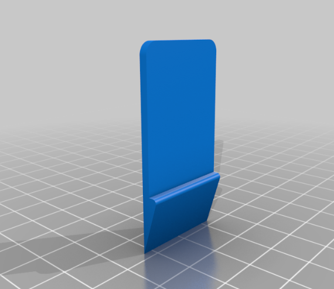

# Espaçadores de Bateria Voltz EVS.

- Folga na Bateria EVS? Resolva esse problema da melhor maneira possível!

  

## 🌟 Objetivo / O que você vai aprender

Nesse vídeo mostro como resolver a folga na bateria da moto Voltz EVS de maneira simples, eficaz e sem prejudicar o encaixe do conector.  

No meu caso, usei folha de EVA de 3mm e colei os espaçadores com fita dupla face.  

## ⏱️ Imagens ou Prints importantes do vídeo/tutorial

  

## 💾 Arquivos para Download:  
- Download do arquivo 3D: <strong><a href="https://github.com/togwar/voltz-evs/raw/main/Solucoes/Euller3D/Espacadores-de-bateria-Voltz-EVS/5783904.zip" target="_blank" rel="noopener noreferrer">5783904.zip</strong>

