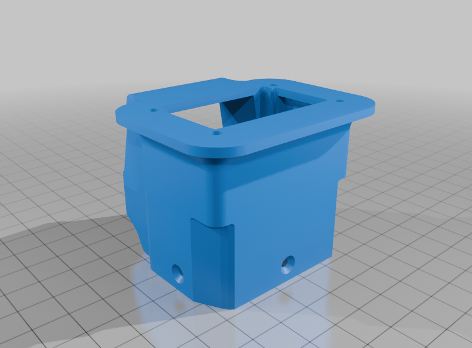

# Euller Labs - Carregando a Voltz EVS na Garagem!.

- Carregando a Voltz EVS na Garagem!  

  

## 🌟 Objetivo / O que você vai aprender

Nesse vídeo mostro o esquema que fiz na para poder carregar minha moto elétrica (Voltz EVS) na garagem. Dessa forma não preciso retirar as baterias para levar para o apartamento.    

## ⏱️ Imagens ou Prints importantes do vídeo/tutorial

  

## 💾 Arquivos para Download:  
- Download do arquivo 3D: <strong><a href="6875638.zip" target="_blank" rel="noopener noreferrer">6875638.zip</strong>