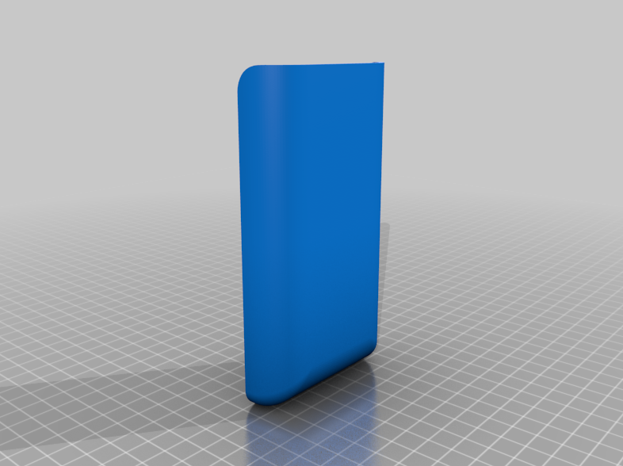

# Euller Labs - Espaçadores de Bateria Voltz EVS.

- Proteja seu conector contra água! Voltz EVS

  

## 🌟 Objetivo / O que você vai aprender

Nesse vídeo mostro um Protetor para o conector de Bateria localizado no fundo do compartimento da moto Voltz EVS. As peças foram modeladas e desenvolvidas por mim.  

## ⏱️ Imagens ou Prints importantes do vídeo/tutorial

