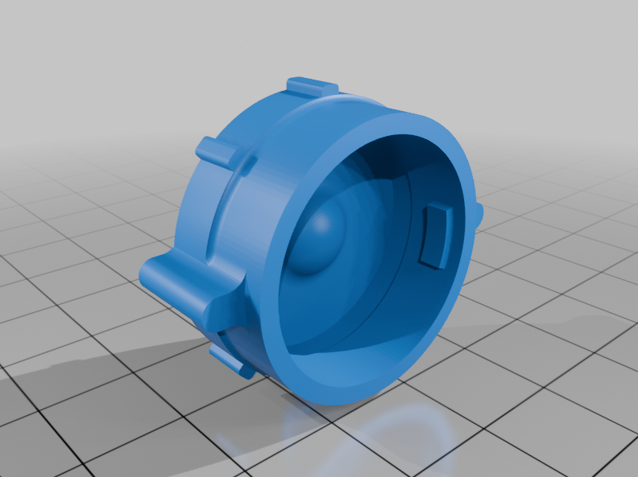

# Euller Labs - Espaçadores de Bateria Voltz EVS.

- Proteja seu conector contra água! Voltz EVS

  

## 🌟 Objetivo / O que você vai aprender

Nesse vídeo mostro uma solução simples para impedir a entrada de água pelo conector de carregamento externo da Voltz EVS.  

## ⏱️ Imagens ou Prints importantes do vídeo/tutorial

