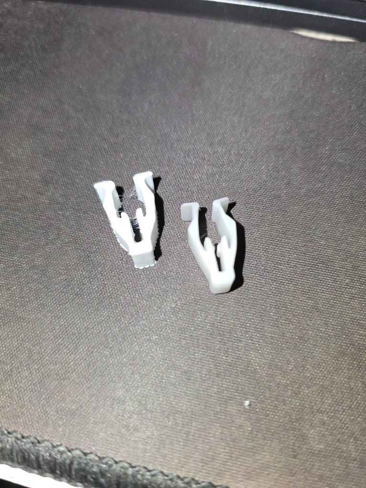
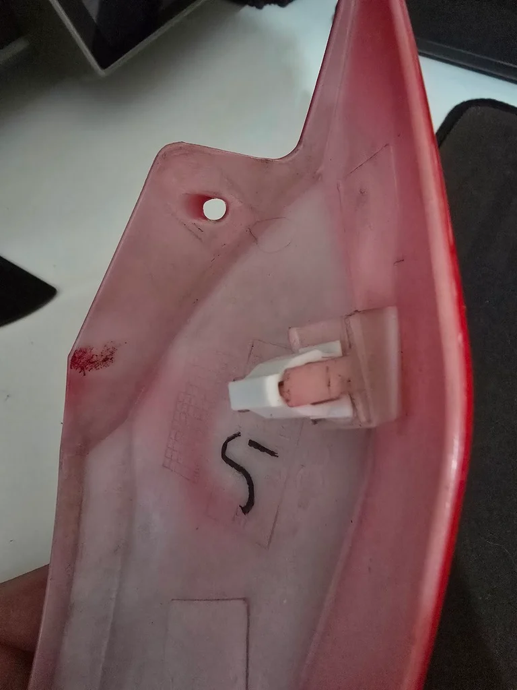

# Trava de Carenagem Universal Impressa em 3D para Voltz EVS / EVS Work

## 🌟 Objetivo / O que você vai aprender

Este modelo 3D foi desenvolvido para **repor a trava plástica original** que fixa as carenagens laterais e frontais das motos elétricas **Voltz EVS e EVS Work**.

Muitas vezes, a peça original se quebra devido à vibração ou durante a remoção da carenagem. Este modelo impresso em 3D é uma solução prática para manter as carenagens firmemente fixadas, prevenindo ruídos e folgas.

## 🧰 Conteúdo do Repositório

Aqui você encontra os arquivos para reproduzir e utilizar a trava:

## 🧰 Conteúdo do Repositório

Aqui você encontra os arquivos para reproduzir e utilizar a trava:

* **Download Original**: Caso haja versões atualizadas, baixe o arquivo STL diretamente na página do Thingiverse: [https://www.thingiverse.com/thing:6945081/files](https://www.thingiverse.com/thing:6945081/files)

* **Trava-Universal-Voltz.zip**: Arquivo compactado contendo o modelo 3D (formato STL) da versão atual (V1.0) para referência rápida.
* **Imagens de Exemplo**: Fotos que demonstram a peça comparada ao original e sua aplicação na carenagem.

## 📐 Instruções de Impressão (Sugestões)

Para obter a melhor resistência e durabilidade da peça, recomendamos as seguintes configurações de impressão (baseado em filamento PETG ou ABS, que são mais resistentes que PLA):

* **Filamento Sugerido**: PETG ou ABS (para maior resistência e calor).
* **Infill (Preenchimento)**: 100% (para máxima resistência e solidez da peça).
* **Altura de Camada (Layer Height)**: 0.15mm a 0.20mm.
* **Suportes**: Não são necessários para este modelo.

## ⏱️ Imagens ou Prints importantes

As imagens a seguir mostram a diferença entre o modelo impresso em 3D e a peça original, além de como ela fica instalada.

**Comparação entre a trava modelada (esquerda) e a trava original (direita):**

**Trava impressa em 3D instalada na carenagem da moto:**

---