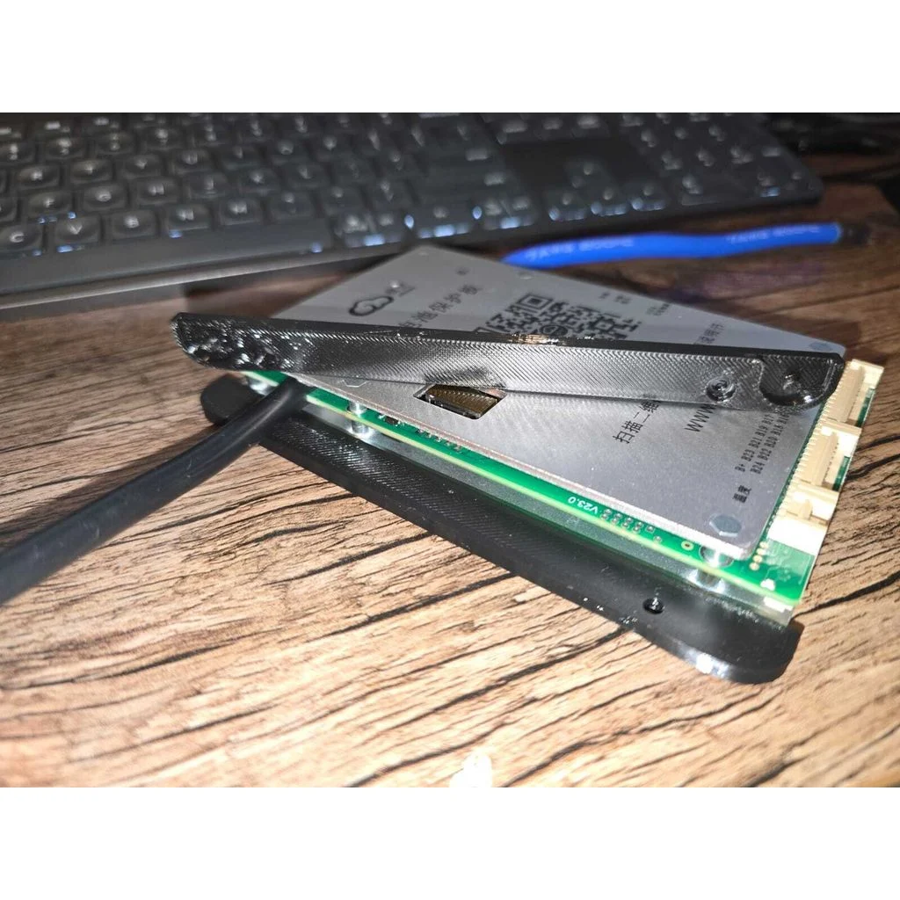
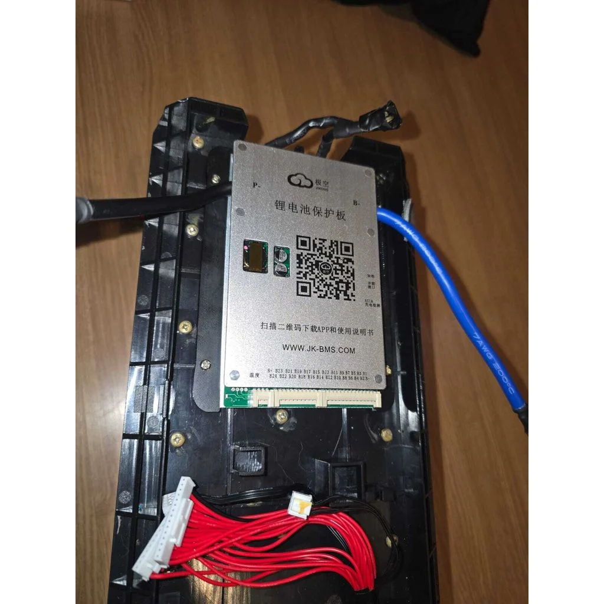

# Suporte Adaptador de BMS JK para Voltz EVS / EVS Work

## 🌟 Objetivo / O que você vai aprender

Este modelo 3D foi desenvolvido para **fixar a BMS na estrutura da bateria da VOLTZ EVS e EVS Work** dando fixação e mais segurança para o seu projeto.

Este é um guia adaptador projetado para fixar a placa **BMS JK-BD6A24S-8P** perfeitamente dentro da carcaça original da bateria das motos Voltz EVS e EVS Work. A peça permite o uso das furações originais da caixa da bateria, garantindo uma instalação limpa, segura e sem a necessidade de fazer novos furos, usar cola ou deixar a placa solta.

## 🧰 Conteúdo do Repositório

Aqui você encontra os arquivos para reproduzir e utilizar a trava:

## 🧰 Conteúdo do Repositório

Aqui você encontra os arquivos para reproduzir e utilizar a trava:

* **Download Original**: Caso haja versões atualizadas, baixe o arquivo STL diretamente na página do Thingiverse: [https://www.thingiverse.com/thing:7369986/files](https://www.thingiverse.com/thing:7369986/files)

* **Suporte_Adaptador_BMSJK_EVS_EVSWork.zip**: Arquivo compactado contendo o modelo 3D (formato STL) da versão atual (V1.0) para referência rápida.
* **Imagens de Exemplo**: Fotos que demonstram a peça comparada ao original e sua aplicação na carenagem.

## 📐 Instruções de Impressão (Sugestões)

Para obter a melhor resistência e durabilidade da peça, recomendamos as seguintes configurações de impressão (baseado em filamento PETG ou ABS, que são mais resistentes que PLA):

* **Filamento Sugerido**: PETG ou ABS (para maior resistência e calor).
* **Infill (Preenchimento)**: 100% (para máxima resistência e solidez da peça).
* **Altura de Camada (Layer Height)**: 0.15mm a 0.20mm.
* **Suportes**: Não são necessários para este modelo.

## ⏱️ Imagens ou Prints importantes

As imagens a seguir mostram a diferença entre o modelo impresso em 3D e a peça original, além de como ela fica instalada.

**Foto demonstrando o encaixe da peça na BMS:**

**Suporte 3D instalado na BMS e na Bateria**

---