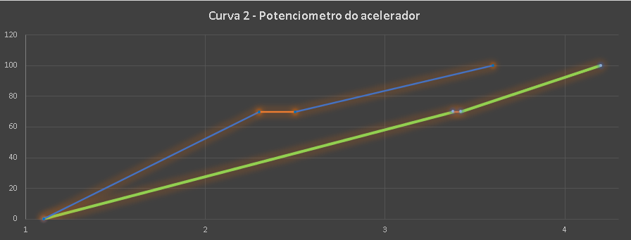
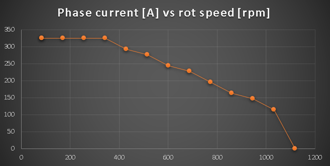
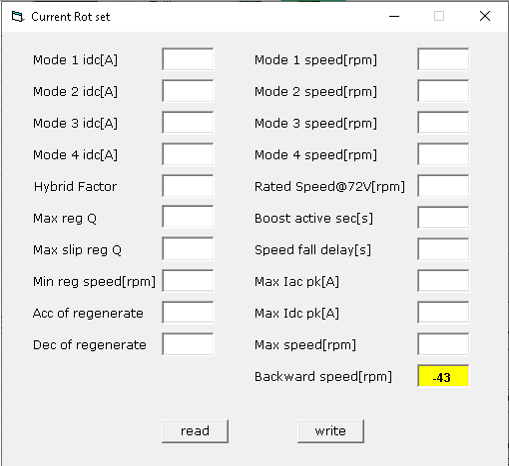
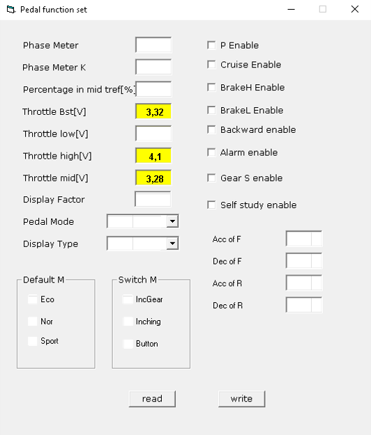
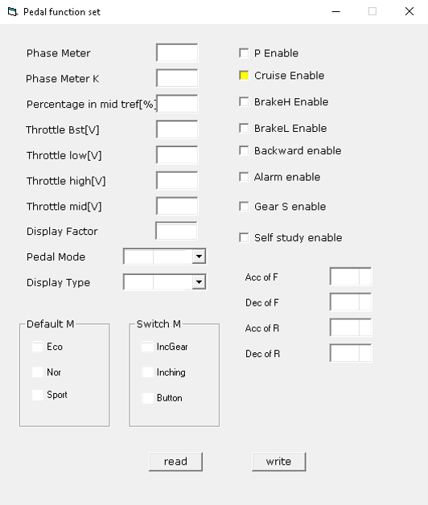

# GuerraMod v8 – Projeto Voltz EVS (2026)

**Versão:** 8.0  
**Ano:** 2026  
**Modelo:** EVS com duas Baterias (ou superior)  
  
**Status:** Consolidação Técnica Estável  
**Autor:** Tiago Guerra  
**Plataforma:** Voltz EVS  
**Controladora:** APT (original da Voltz EVS)  
**BMS:** Original ou Não  
**TBOX:** Original ou Sem  

---

## 📚 Sumário

1. [Introdução](#1-introdu%C3%A7%C3%A3o)
2. [Configuração Original de Fábrica](#2-configura%C3%A7%C3%A3o-original-de-f%C3%A1brica)
3. [Premissas Técnicas do Projeto](#3-premissas-t%C3%A9cnicas-do-projeto))
4. [Filosofia de Calibração](#4-filosofia-de-calibra%C3%A7%C3%A3o) 
5. [Configuração Base – GuerraMod v8](#5-configura%C3%A7%C3%A3o-base--guerramod-v8)  
	5.1 [Alterações Mínimas para conforto e segurança](#51-altera%C3%A7%C3%B5es-m%C3%ADnimas-para-conforto-e-seguran%C3%A7a)  
			5.1.1 [Velocidade da Marcha Ré](#511-ajuste-do-limite-de-velocidade-da-marcha-r%C3%A9-backward-speedrpm)  
   			5.1.2 [Ajuste fino do Acelerador](#512-ajuste-fino-e-mais-linear-do-acelerador-com-rela%C3%A7%C3%A3o-ao-torque-throttle-v)  
   			5.1.3 [Controle de Cruizeiro](#513-ativando-o-controle-de-cruzeiro)
6. [Configuração Intermediária – GuerraMod v8](#6-configura%C3%A7%C3%A3o-intermedi%C3%A1ria--guerramod-v8)  
 	6.1 [Pedal Function](#61-pedal-function)  
	6.2 [Voltage Set](#62-voltage-set)  
	6.3 [Current Rotation](#63-current-rotation)  
	6.4 [Torque PID](#64-torque-pid)  
	6.5 [IAC Set](#65-iac-set)  
7. [Freio Regenerativo](#7-freio-regenerativo)
    7.1 [Perfil Cidade](#71-perfil-cidade)  
	7.2 [Perfil Rodovia](#72-perfil-rodovia)  
	7.3 [Regeneração](#73-regenera%C3%A7%C3%A3o)  
8. [Conclusão e Resumo](#8-conclus%C3%A3o-e-resumo)

---

## 1. Introdução

A Voltz EVS representa uma das primeiras tentativas de popularização da mobilidade elétrica sobre duas rodas no Brasil.  
Apesar do mérito do projeto, a calibração original da controladora APT foi concebida de forma genérica, buscando atender um amplo espectro de cenários, usuários e condições climáticas.

Na prática, isso resultou em uma motocicleta funcional, porém com comportamento pouco refinado, especialmente em uso urbano intenso, rodovias longas e regiões de serra.

Essa é uma nova versão aberta ao públíco do **GuerraMod**, que vem para substituir as versões anteriores (v3, v4 e v5).

O GuerraMod surgiu a partir da minha insatisfação por ausência de funcionalidades na EVS e instabilidade, após os pares de versões internas exploratória (v1/v2 e v6/v7) que tinham como objetivo documentação, registrando hipóteses, tentativas e descobertas empíricas. Cada uma dessas versões foram contabilizados minimamente 1.000 km de testes por versão.  
  
O **GuerraMod v8** rompe com esse caráter experimental e estabelece uma **configuração técnica consolidada**, provavelmente será a versão final, ao longo de 4 anos de estudos e descobertas, em sua maioria as cegas e por iniciativa própria.  

Aqui também destaco um agradecimento especial ao ex-funcionarios, engenheiros e mecânicos da Voltz que participaram deste projeto desde a sua concepção, e nessa fase final com a participação dos engenheiros da APT no double check teórico desta revisão final.

---

## 2. Configuração Original de Fábrica

A configuração original da Voltz EVS apresenta as seguintes características:

- Limites de corrente DC pouco restritivos  
- Nenhuma regeneração
- Ausência de Controle de Cruzeiro  
- Uso genérico de *Flux Weakening*  
- Ausência de perfis distintos de uso  
- Nenhuma documentação técnica pública  

Essas escolhas **não são erros**, mas reflexos de uma filosofia de calibração **conservadora e genérica**.

---

## 3. Premissas Técnicas do Projeto

Premissas adotadas no **GuerraMod v8**:

1. Firmware Base ideal:
	- **A1705_V10000_EVS_IA_130_YM-T9.dat**, powered by APT [saiba mais](https://github.com/togwar/voltz-evs/tree/main/Firmware/APT/evs#%EF%B8%8F-a1705_v10000_evs_ia_130_ym-t9dat---12dez2025)
	- **OU** A1705_V10000_EVS_130_YM-T7.dat, powered by APT [saiba mais](https://github.com/togwar/voltz-evs/tree/main/Firmware/APT/evs#%EF%B8%8F-a1705_v10000_evs_130_ym-t7dat---12dez2025)
2. Motor **in-wheel IPMSM** (sem redução mecânica)  
3. **Corrente DC** como principal fator de stress do sistema  
4. Rotação física máxima ≈ **1100 rpm** (≈ **130 km/h**)  
5. Bateria Li-ion **20S** (2 packs ou mais) (versão de 1 bateria em breve)  
6. *Flux Weakening* tratado apenas como extensão, não como solução  
7. **BLOCOS DE CONFIGURAÇÕES**, as alterções são relacionadas em blocos, você só deve ignorar o que está destacado como (Opcional).

---

## 4. Filosofia de Calibração

O **GuerraMod v8** se baseia em quatro pilares:

1. Previsibilidade  
2. Durabilidade  
3. Conforto  
4. Segurança  

A calibração **não busca performance máxima**, mas **coerência, repetibilidade e estabilidade** no uso real, visando longevidade do conjunto.

---

## 5. Configuração Base – GuerraMod v8

### 5.1 Alterações Mínimas para conforto e segurança

#### 5.1.1. Ajuste do "**Limite de velocidade da marcha ré**" (Backward speed[rpm])
- (Opcional) Alteração do valor de -150 para **-43 em CURRENT ROT / Backward speed[rpm]**.
	> Velocidade máxima real (5km/h), muito mais segura e confortável para manobras. Não faz sentido possuir uma ré a 20km/h.  
	> Inalterado a força e a potência da "marcha ré".  
	> Essa configuração não oferece risco para a controladora.

---

#### 5.1.2. Ajuste fino e mais linear do **acelerador com relação ao Torque** (Throttle [V])
- (Opcional) Alteração do valor **de 70 para 75** em PEDAL FUNCTION / **Percentage in mid tref[%]**.    
- Alteração do valor **de 2,3999 para 3,2500** em PEDAL FUNCTION / **Throttle Bst[V]**.  
- Alteração do valor **de 3,4999 para 4,1000** em PEDAL FUNCTION / **Throttle high[V]**.  
- Alteração do valor **de 2,1994 para 3,2800** em PEDAL FUNCTION / **Throttle mid[V]**.  
- (Opcional) Alteração do valor **de ECO para STD** em PEDAL FUNCTION / **Default M**.
	> Maior controle na entrega de torque na faixa média do acelerador; afeta sensação de resposta sem alterar potência máxima ou correntes.  
	> Ajuste fino de como o acelerador fica mais responsivo para o controle da moto em acelerações, agora o poder fica na mão do condutor.  
	> Inalterado a força e a potência da "marcha ré".  
	> Alteração de qual modo de condução, ECO/STD/TURBO é o padrão ao ligar a moto.  
	> Essas configurações não oferecem risco para a controladora.
		

- Com esses ajustes, a moto passa a entregar sua potência de acordo com o giro do acelerador com 2x mais precisão, resultando em uma maior linearidade.

- Na imagem abaixo, temos um gráfico comparando a configuração original da moto (em AZUL) com a alteração propósta (em VERDE).

---

#### 5.1.3. Ativando o Controle de Cruzeiro.
- O Cruise Control é uma função nativa da controladora APT, para ativá-la, no menu **PEDAL FUNCTION / Cruise Enable**.  
- Para ativá-la, com a moto andando em uma **velocidade superiror** a 30 km/h, **mantenha fixo, preciso e estável o acelerador**, mantendo a moto acelerando na posição que deseja, e precione o botão de ré ("R" na mão esquerda).
- Talvez você sinta uma sutil acelerada, e pode soltar o acelerador que ela irá manter, até que você acelere ela novamente ou encoste no freio (aparecer o "P" no painel).
- ⚠**Atenção**: Caso salve o controle de cruzeiro em um modo inferior, exemplo 90% do ECO, e se você alterar o modo de condução, a moto continuará com o controle de cruzeiro ativo, porém ganhará a força extra do modo Standard. O inverso também se aplica.

	> - Essa função veio desativada pela Voltz na família EVS.😡  
	> - Essa função permite a moto manter acelerando em **uma potência** (não velocidade) constante fixa de acordo com o momento que você ativou ela.
	> - Essa configuração não oferece risco para a controladora.
	> - Não habilite essa função para ficar andando sem as mãos na moto, **exceto se você trabalha em um círco** ou é profissional de entreterimento. 🤣

---

## 6. Configuração Intermediária – GuerraMod v8

Antes de proceguir-mos deixo claro, pois foi o que mais escutei ao longo dos testes com os mais de 30 voluntários pelo Brasil, que usaram minhas configurações:  

**A MOTO É LIMITADA PELO SEU EQUIPAMENTO!**  

Ela já atua no limite; Tal limite que, em alguns casos, resulta sobrecarga, super-aquecimento, falhas, e até componentes sendo danificados prematuramente; (Obviamente que isso depende diretamente do modo de condução e do clima ambiente.)

**Concluíndo, não há como fazer sua Voltz EVS virar uma 1000cc, tão pouco uma 300cc, sem trocar/modificar equipamentos.**  

Agora partiremos para ajustes intermediarios que irão alterar a moto, e ajustar parametros que **corrigem, aprimoram e aumentam o conforto de pilotagem**, visando **longevidade e estabilidade**, de acordo com o conjunto de equipamentos que existe na moto Voltz EVS.

⚠**Atenção**: Não altere os valores deliberadamente, as configurações abaixo podem haver relação com N outros parametros, uma mudança que pode parecer simples de "mudar uma potência" pode refletir em todo o conjunto e cálculos que a controladora faz para manter a moto funcionando em sua plenitude, tenha **"MUITO CUIDADO"**, e não sabe o que está fazendo, não altere para um valor deliberado.  

---

**Vamos ao que interessa:**  

### 6.1 Pedal Function
- (Opcional) Alteração do valor **de 5000 para 5500** em **Acc of F**.
	> Aumento da taxa de aceleração do acelerador frontal; melhora resposta em retomadas e uso em rodovia sem aumentar potência máxima.   

---

### 6.2 Voltage Set

- Alterar o valor em **Under vdc[V]** de 62 para **64**.  
	> Menor stress das células; menor aquecimento interno; aumento da vida útil do pack.  
- Alterar o valor em **Under vdc recover[V]** de 63 para **65**.  
	> Recuperação de potência mais suave; evita oscilação em tensão baixa.  
- Alterar o valor em **Vdc of idc limit[V]** de 65 para **67**.  
	> Redução gradual de potência; melhor eficiência do FOC; menor ripple de corrente.  
- Alterar o valor em **Vdc of idc min[V]** de 62 para **64**.  
	> Evita queda abrupta de desempenho em baixa tensão; melhora previsibilidade.  
- Alterar o valor em **Idc min percent[%]** de 20 para **30**.  
	> Evita sensação de “moto morrendo”; mantém controle em baixa tensão.  
- Alterar o valor em **Li-ion series Q** de 18 para **20**.  
	> Correção do número de células em série (20S). Essencial para cálculos internos.  
- Alterar o valor em **Li-ion Cell HighV[V]** de 41 para **42**.  
	> Alinhamento com Vdc full reg (84 V) e Highest vdc for reg (84,5 V).  
- Alterar o valor em **Li-ion capacity[Ah]** de 0 para **66**.  
	> 33 por bateria. Capacidade nominal configurada para referência interna e telemetria.  

---

### 6.3 Current Rotation

- Alterar o valor em **Mode 4 idc[A]** de 80 para **110**.  
	> Mode 3 idc ≤ Mode 4 idc; Evita clipping; Manter estabilidade térmica.  
- Alterar o valor em **Hybrid Factor** de 30 para **35**.  
	> 35 otimiza resposta em média/alta velocidade sem comprometer suavidade.  
- Alterar o valor em **Mode 4 speed[rpm]** de 2500 para **1100**.  
	>  Controle interno consistente; Valor atingivel, reflete a realidade da moto. Flux weakening ser usado como extensão, não como muleta.”  
- Alterar o valor em **Boost active sec[s]** de 60 para **15**.  
	> Tempo reduzido para evitar mascarar aquecimento e preservar estabilidade térmica. Evitar manter a corrente elevada demais.  
- Alterar o valor em **Max Iac pk[A]** de 400 para **325**.  
	> Limite de corrente AC ajustado para reduzir calor, ruído eletromagnético e stress no estator e vibração;  
- Alterar o valor em **Max speed[rpm]** de 2500 para **1100**.  
	> FOC não tente empurrar fluxo além do útil; PID não fique “caçando” torque inexistente; flux weakening opere só onde realmente funciona.  

---

### 6.4 Torque PID

- Alterar o valor em **Iq kp gain 0 pre** de 1 para **2**  
	> Ganho proporcional pré-regime; auxilia resposta inicial sem gerar overshoot.
- Alterar o valor em **Iq ki gain 0 pre** de 25 para **40**  
	> Ganho integral pré-regime; corrige erro estático em baixa carga.
- Alterar o valor em **Iq ki gain 0** de 25 para **40**  
	> Ganho integral em regime normal; garante estabilidade de torque em cruzeiro
- Alterar o valor em **Iq kp gain 3** de 5 para **4**  
	> Redução leve do ganho proporcional em alta rotação; mantém resposta e reduz risco de instabilidade térmica e em flux weakening.
- Alterar o valor em **Iq ki gain 3** de 80 para **60**  
	> Redução do ganho integral em alta rotação; diminui aquecimento e elimina risco de oscilação em FW.

---

### 6.5 IAC Set  

- Alterar o valor em **Iqref 4[%]** de 95 para **100**  
	> Zona de transição para torque médio; melhora dirigibilidade urbana.
- Alterar o valor em **Iqref 5[%]** de 85 para **90**  
	> Mapeamento de torque médio; adequado para tráfego contínuo e retomadas suaves.
- Alterar o valor em **Iqref 6[%]** de 80 para **85**  
	> Faixa de torque médio-alto; equilíbrio entre desempenho e eficiência térmica.

---

## 7. Freio Regenerativo

Um dos assuntos mais cobiçados por todos. E, **totalmente Opcional**; leia atentamente antes de tomar sua decisão...

Para a maioria, não é porque ele irá quebrar as leis da física, e resultar em uma geração de energia avassaladora, ele jamais lhe proporcionará isso.  
Mas qual a vantagem de possuir freio regenerativo??  (OBS: Eu nem gosto desse nome, mas é o popular, por isso usei.)  

Dentre as principais vantagens posso listar:  
1. **Conforto**... Sensação de freio motor;  
2. **Controle** e segurança em curvas, principalmente em declives.  
3. **Ferramenta auxiliar**, não como substituta do freio mecânico.  
4. **Econômia**... NÃO! De manutenção! Principalmente dos **díscos de freio** e **pastilhas**.  
5. **Autonomia**, em "último lugar", ele proporciona em média real e geral, algo entre de 7% a 15% dependendo de inúmeros fatores.

Agora que desbravamos um dos principais vantagens do "Freio Regenerativo", se acredita que ele é funcional, continue, pois **agora precisa se decidir, em qual perfil** você se enquadra melhor, e **escolha apenas um.**

### 7.1 Perfil Cidade

**Objetivo:**
- Conforto  
- Controle em baixa velocidade  
- Regeneração mínima  

**Principais ajustes:**
- Min reg speed = 300 rpm (≈ 35 km/h)  
- Max slip reg Q = 0  

---

### 7.2 Perfil Rodovia

**Objetivo:**
- Estabilidade  
- Freio motor leve  
- Menor desgaste mecânico  

**Principais ajustes:**
- Min reg speed = 400 rpm (≈ 48 km/h)  
- Max slip reg Q = -300  

---

## 7.3 Regeneração

A regeneração no **GuerraMod v8** é tratada como **ferramenta auxiliar**, não como substituta do freio mecânico.

**Configuração original:**
- Regeneração irregular  
- Pouco previsível  

**GuerraMod v8:**
- Regeneração progressiva  
- Corrente limitada  
- Respeito à capacidade da bateria  

---

## 8. Conclusão e Resumo

O **GuerraMod v8** encerra o ciclo de experimentação e estabelece uma **documentação técnica madura**, aplicável e defensável para a plataforma **Voltz EVS**.

---

> ⚠️ **Aviso**  
> Este projeto não possui vínculo oficial com a Voltz Motors.  
> O uso das informações aqui descritas é de responsabilidade do usuário.

